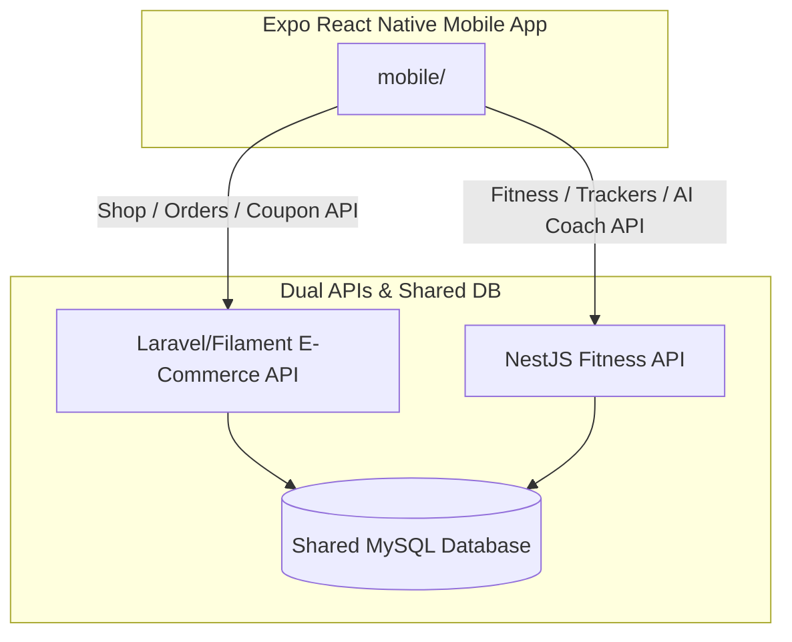

# BRIEFING & INSTRUCTIONS: Protein.tn Mobile Redesign & Polish

You are an expert React Native mobile UI/UX designer and developer. Your mission is to take the existing Expo React Native mobile application (`mobile/`) and redesign it to look **extremely premium, nice, modern, attractive, and professional**—matching the aesthetic of top-tier fitness and sports nutrition apps.

---

## 1. Project Background & Shared Architecture

The `protein.tn` project is a unified health, fitness, and e-commerce ecosystem consisting of:

* **Laravel / Filament Backend (E-Commerce):** Serves products, categories, brands, orders, and handles coupon checkups. Located on VPS at: `http://145.223.118.9:8083/api`.
* **NestJS Backend (Fitness & Loyalty):** Handles BMR calculations, water logs, protein trackers, body progress, workouts, referrals, loyalty balance, and AI Coach history. Located on VPS at: `http://145.223.118.9:4000/api/v1`.
* **Shared Database:** Both backends access the same MySQL database instance (`protein_db`).

---

## 2. Redesign Guidelines & Asset Mappings

### A. Use Brand Design Assets from the Web Frontend
Do not use placeholder shapes or default system icons. Incorporate the official assets found inside the web `frontend/` workspace:

* **Official Branding Logos:**
  * [logo-sobitas.png](file:///c:/Users/Ala/Desktop/sobitas-project/frontend/public/logo-sobitas.png)
  * [sobitas-logo.png](file:///c:/Users/Ala/Desktop/sobitas-project/frontend/public/sobitas-logo.png)
  * [logo.png](file:///c:/Users/Ala/Desktop/sobitas-project/frontend/public/logo.png)
  * [logo1.png](file:///c:/Users/Ala/Desktop/sobitas-project/frontend/public/logo1.png)
* **High-Quality Mobile Hero Banners:**
  * Use the optimized slides from `frontend/public/slides/` in the mobile app home carousel:
    * Primary Mobile Banner: [home-hero-mobile.webp](file:///c:/Users/Ala/Desktop/sobitas-project/frontend/public/slides/home-hero-mobile.webp)
    * Auxiliary Mobile Banner: [mobile.png](file:///c:/Users/Ala/Desktop/sobitas-project/frontend/public/slides/mobile.png)

### B. Aesthetic & Styling Goals
* **Palette:** Focus on a high-octane, dark athletic aesthetic:
  * Primary Orange: `#FF6B00` (High contrast, premium brand accent)
  * Dark Charcoal/Black: `#121212` (Backgrounds, headers)
  * Soft Card Backgrounds: `#FFFFFF` (Light mode grids), `#1E1E1E` (Dark mode elements)
* **Glassmorphism:** Apply transparency and blur effects on floating banners, summaries, and sliders.
* **Micro-Animations:** Use `react-native-reanimated` to add smooth transitions, hover scalings, loading shimmers, and interactive progress loaders (e.g. circles filling up with water or protein bars loading).
* **Typography:** Use modern, bold sans-serif font weights for displays, and clean, readable sizing for metadata.

---

## 3. Scope of Redesign (Screens to Refactor)

Review and completely redesign the following layout files in `mobile/src/app` and components in `mobile/src/components`:

1. **`(tabs)/index.tsx` (Home Screen):** Replace the basic hero view with an interactive, animated image slider using `home-hero-mobile.webp`. Design premium grids for categories and flash sales.
2. **`(tabs)/shop.tsx` (Shop Screen):** Build a stunning catalog search grid with clean filters (pricing, brands, categories), sorting sliders, and hover-scaled product cards.
3. **`(tabs)/fitness.tsx` (Fitness Dashboard):** Redesign the circular hydration rings and protein logs into interactive widgets. Show macro percentages beautifully.
4. **`(tabs)/rewards.tsx` (Fidélité & Parrainage):** Make the loyalty tiers (Bronze, Silver, Gold, Elite) look like premium membership cards. Create a clean parrain code share/redeem component.
5. **`(tabs)/profile.tsx` (Profile & Actions):** Streamline settings navigation rows, orders log link, and wishlists.
6. **`workouts/[id].tsx` (Active Workout Session):** Redesign the exercise stopwatch timer and checklist. Make checking sets completed feel responsive and rewarding.
7. **`supplement-stack.tsx` (Supplements Stack):** Show stock alerts and refill warnings with high-fidelity badges. Make the AI supplement recommender list look sleek.
8. **`ai-coach.tsx` (AI Chatbot):** Turn this into an elegant conversation screen with sporty speech bubbles, coach loading animations, and clear medical disclaimers.
9. **`calculator.tsx` (BMR & Calories Calculator):** A gamified, step-by-step calculator widget with interactive slides.

---

## 4. Technical Constraints (DO NOT BREAK)

* **Zustand State Stores:** Keep `useAuthStore` (auth/sessions), `useCartStore` (orders/coupons), and `useFitnessStore` (offline trackers queue).
* **API clients:** Keep `shopApi` (Laravel) and `fitnessApi` (NestJS) endpoints, interceptors, and platform resolution hooks intact.
* **Offline-first Queue Sync:** Do not alter the network connection listeners or background queue syncing hooks.
* **Expo SDK 51 Compatibility:** Keep all downgraded dependencies as configured in `package.json`. Do not re-enable experimental settings like `reactCompiler` which breaks React 18 runtimes.

---

## Getting Started

1. Check out the current source code in `mobile/src/`.
2. Inspect the design files in `frontend/public/` to extract color configurations and image assets.
3. Polish the stylesheet designs to create a world-class application interface!
