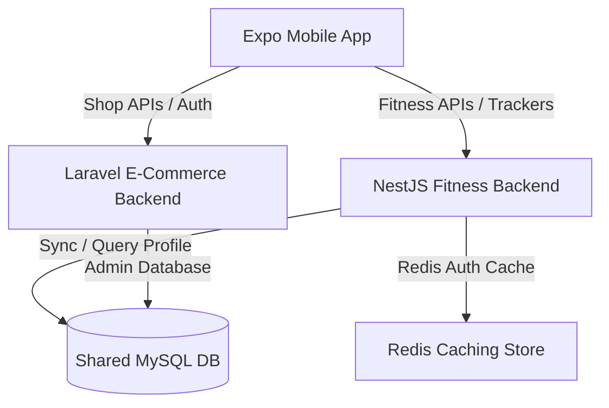

# Fitness API Architecture - Protein.tn Integration (MySQL Shared DB)

This document describes how the existing Laravel e-commerce backend and the new NestJS fitness backend communicate, share user identities, and integrate on the same MySQL database.

## Architecture Overview

We operate under a shared database architecture:
1. **Laravel Backend:** Source of truth for products, orders, customers, pricing, inventory, and payment verification.
2. **NestJS Backend:** Microservice for fitness ecosystem features (trackers, workouts, AI Coach, loyalty points).
3. **MySQL Database (`protein_db`):** Shared database. Laravel tables and NestJS tables sit side-by-side in the same database, allowing high-performance queries, direct identity resolution, and transactional consistency.
4. **Expo Mobile Client:** Unified application talking to both backends.



---

## Authentication & Token Exchange Flow (Direct DB Verification)

Since both backends share the same MySQL database, NestJS can authenticate Laravel Sanctum tokens directly by querying the database, eliminating the latency of HTTP loopbacks.

### 1. Token Anatomy
Laravel Sanctum tokens have the format `id|token_value` (e.g., `12|abcdef123456...`), where:
- `id` is the auto-increment primary key of the token in the `personal_access_tokens` table.
- `token_value` is the plain text secret token.

In the MySQL database:
- The token is stored in the `personal_access_tokens` table.
- The `token` column contains the SHA-256 hash of `token_value`.
- The `tokenable_id` column contains the `id` of the user in the `users` table.

### 2. NestJS Guard Authentication Logic
When the mobile client calls a fitness API with the header `Authorization: Bearer <token>`:
1. NestJS checks the Redis cache for the session. If found, it attaches the cached user details to the request.
2. If not cached, NestJS parses the token:
   - Split the token by `|` into `tokenId` and `tokenValue`.
   - Compute the SHA-256 hash of `tokenValue`: `crypto.createHash('sha256').update(tokenValue).digest('hex')`.
3. Query the MySQL database:
   ```sql
   SELECT * FROM personal_access_tokens WHERE id = ? LIMIT 1
   ```
4. If found, verify that the computed SHA-256 hash matches the `token` stored in the database.
5. If verified, query the `users` table:
   ```sql
   SELECT id, name, email, phone FROM users WHERE id = ? LIMIT 1
   ```
6. Cache the verified user session in Redis (TTL: 5 minutes) and attach the user to the request context.

---

## Shared Database Schema & Isolation

To prevent conflicts, NestJS tables will be prefixed with `fitness_` or modeled as clean, isolated tables within the same database:
- `fitness_profiles`
- `fitness_water_logs`
- `fitness_protein_logs`
- `fitness_body_progress`
- `fitness_workout_programs`
- `fitness_exercises`
- `fitness_workout_logs`
- `fitness_supplement_recommendations`
- `fitness_supplement_stacks`
- `fitness_loyalty_point_transactions`
- `fitness_referrals`
- `fitness_chat_histories`
- `fitness_notification_templates`
- `fitness_notification_logs`

By using the same database, the Supplement Advisor in NestJS can run queries directly joining the `fitness_supplement_recommendations` with Laravel's existing `products` table, ensuring maximum speed.
